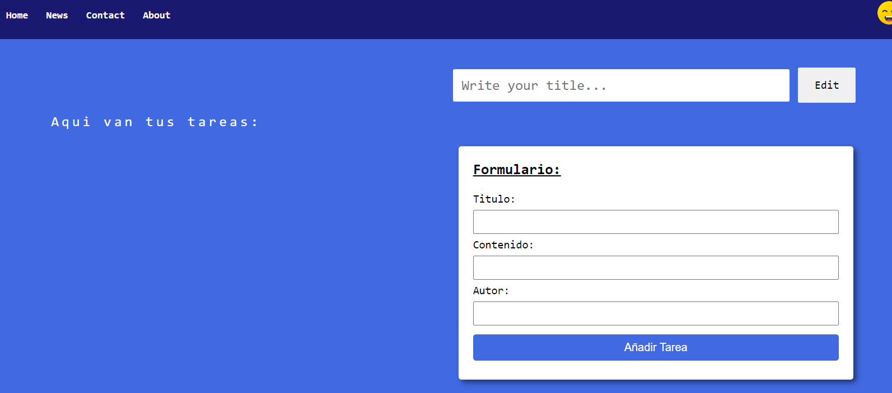
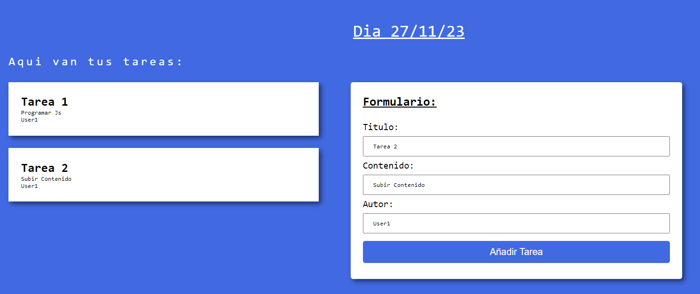
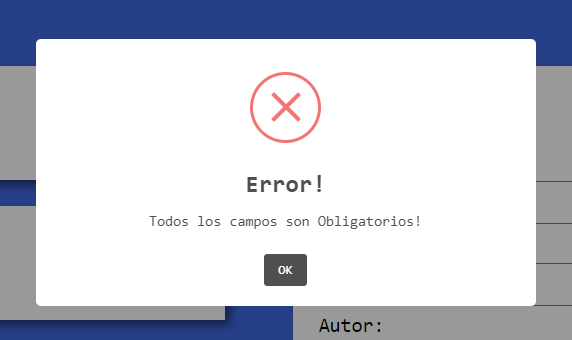

# TASK TO DO: 

### Proyecto básico de Tareas donde podremos:...
<ul>
  <li>Crear tareas</li>
  <li>Agregar el Titulo de la tarea</li>
  <li>Agregar contenido de la tarea especifica</li>
  <li>Agregar autor o persona a realizar</li>
  <li>Añadir foto en el nav desde dispositivo (Modo app de usuario)</li>
</ul>
 

Dentro de la app tenemos herramientas básicas empleadas con (Html, Css, Javascript) y algunas librerias como:

<b><a href="https://sweetalert2.github.io/">➡ Sweet Alert: </a></b>Usada especialmente para incorporar Pop Ups personalizados en nuestra Web de manera agradable e intuitiva</h4>

 
